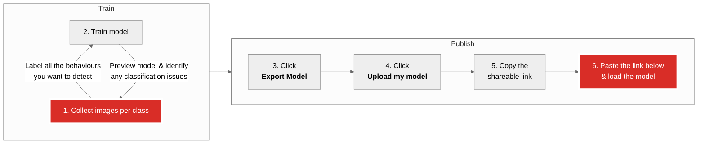

```mermaid
%%{init: {'theme': 'neutral' } }%%
flowchart LR
    subgraph X["Train"]
        direction BT
        A[1. Collect images per class] -->|Label all the behaviours<br>you want to detect| B
        B[2. Train model] -->|Preview model & identify<br>any classification issues| A
    end
    subgraph Y["Publish"]
        direction LR
        D[3. Click<br><b>Export Model</b>] --> E
        E[4. Click<br><b>Upload my model</b>] --> F
        F[5. Copy the<br>shareable link] --> G
        G[6. Paste the link below<br>& load the model]
    end
X --> Y

style A fill:#d92d27,stroke:#ffff,stroke-width:4px,color:#fff
style G fill:#d92d27,stroke:#ffff,stroke-width:4px,color:#fff
```